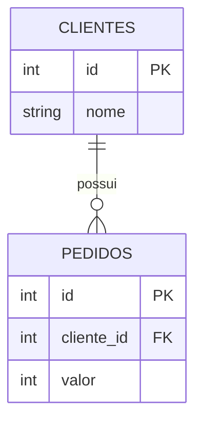

# JOINs: INNER, LEFT, RIGHT, FULL, CROSS

> Parte 2 de 5 — Módulo 1.2 "Agregações e junções" (SQL). Cobre os cinco tipos de JOIN, com exemplo consistente, e quando cada um se aplica.

---

## 2. JOINs: INNER, LEFT, RIGHT, FULL, CROSS

### 2.1 Por que JOINs existem

No modelo relacional, dados relacionados costumam ficar em tabelas separadas, para evitar repetição desnecessária. Por exemplo, uma tabela `pedidos` normalmente não guarda o nome completo do cliente em cada linha — ela guarda apenas um `cliente_id`, que aponta para a linha correspondente na tabela `clientes`.

O `JOIN` é o mecanismo que **junta linhas de duas (ou mais) tabelas**, combinando-as com base em uma condição de relacionamento — geralmente comparando uma chave em uma tabela com a mesma chave em outra.

### 2.2 Tabelas de exemplo usadas nesta seção




```
clientes                       pedidos
+----+----------+              +----+-------------+--------+
| id | nome     |              | id | cliente_id  | valor  |
+----+----------+              +----+-------------+--------+
| 1  | Ana      |              | 1  | 1           | 100    |
| 2  | Bruno    |              | 2  | 1           | 250    |
| 3  | Carla    |              | 3  | 3           | 80     |
+----+----------+              +----+-------------+--------+
```

Note que o cliente **Bruno (id 2)** não tem nenhum pedido, e o pedido de id 3 pertence a um `cliente_id` (3, Carla) que existe na tabela de clientes. Essas "lacunas" propositais ajudam a entender a diferença entre os tipos de JOIN a seguir.

### 2.3 `INNER JOIN` — Apenas o que existe nos dois lados

```sql
SELECT clientes.nome, pedidos.valor
FROM clientes
INNER JOIN pedidos ON clientes.id = pedidos.cliente_id;
```

Resultado:

| nome | valor |
| --- | --- |
| Ana | 100 |
| Ana | 250 |
| Carla | 80 |

O `INNER JOIN` retorna **apenas as linhas que têm correspondência nos dois lados**. Bruno desaparece do resultado, porque não tem nenhum pedido associado — não há linha em `pedidos` que combine com ele.

### 2.4 `LEFT JOIN` (ou `LEFT OUTER JOIN`) — Tudo da esquerda, com ou sem correspondência

```sql
SELECT clientes.nome, pedidos.valor
FROM clientes
LEFT JOIN pedidos ON clientes.id = pedidos.cliente_id;
```

Resultado:

| nome | valor |
| --- | --- |
| Ana | 100 |
| Ana | 250 |
| Bruno | NULL |
| Carla | 80 |

O `LEFT JOIN` mantém **todas as linhas da tabela à esquerda** (`clientes`, a que aparece no `FROM`), mesmo quando não há correspondência na tabela à direita. Quando não há correspondência, as colunas vindas da tabela direita aparecem como `NULL`. Bruno aparece no resultado, mesmo sem nenhum pedido.

### 2.5 `RIGHT JOIN` (ou `RIGHT OUTER JOIN`) — O espelho do LEFT JOIN

```sql
SELECT clientes.nome, pedidos.valor
FROM clientes
RIGHT JOIN pedidos ON clientes.id = pedidos.cliente_id;
```

Mantém **todas as linhas da tabela à direita** (`pedidos`), preenchendo com `NULL` quando não há correspondência à esquerda. Na prática, um `RIGHT JOIN` pode sempre ser reescrito como um `LEFT JOIN` invertendo a ordem das tabelas — por isso o `RIGHT JOIN` é usado com bem menos frequência: a maioria das pessoas prefere manter a tabela "principal" sempre à esquerda e usar só `LEFT JOIN`, por consistência.

### 2.6 `FULL JOIN` (ou `FULL OUTER JOIN`) — Tudo dos dois lados

```sql
SELECT clientes.nome, pedidos.valor
FROM clientes
FULL JOIN pedidos ON clientes.id = pedidos.cliente_id;
```

Combina o comportamento do `LEFT` e do `RIGHT` ao mesmo tempo: mantém todas as linhas de ambas as tabelas, preenchendo com `NULL` onde não há correspondência de nenhum dos dois lados. Retorna tanto o Bruno (sem pedido) quanto qualquer pedido órfão que não tenha cliente correspondente (situação que não deveria acontecer com boas restrições de integridade, mas é tecnicamente possível).

**Nota de compatibilidade**: o MySQL, historicamente, não oferece suporte nativo a `FULL JOIN` — é necessário simular seu comportamento combinando um `LEFT JOIN` e um `RIGHT JOIN` com `UNION`.

### 2.7 `CROSS JOIN` — Todas as combinações possíveis

```sql
SELECT clientes.nome, produtos.nome
FROM clientes
CROSS JOIN produtos;
```

Diferente dos anteriores, o `CROSS JOIN` **não usa condição de relacionamento** — ele combina **cada linha de uma tabela com cada linha da outra**, gerando todas as combinações possíveis (produto cartesiano). Se `clientes` tem 3 linhas e `produtos` tem 5, o resultado terá 15 linhas.

Uso típico: gerar combinações completas para análise (ex.: "todas as combinações possíveis de tamanho e cor de um produto"), não para relacionar dados que já têm uma chave em comum.

### 2.8 Tabela-resumo: quando usar cada JOIN

| JOIN | Retorna | Quando usar |
| --- | --- | --- |
| `INNER JOIN` | Só linhas com correspondência nos dois lados | Quando só interessam registros que existem completos em ambas as tabelas (ex.: pedidos que têm cliente válido) |
| `LEFT JOIN` | Tudo da tabela esquerda, com ou sem correspondência | Quando é necessário manter todos os registros "principais", mesmo sem dado relacionado (ex.: todos os clientes, incluindo os que nunca compraram) |
| `RIGHT JOIN` | Tudo da tabela direita, com ou sem correspondência | Raramente usado — equivalente a inverter as tabelas e usar `LEFT JOIN` |
| `FULL JOIN` | Tudo dos dois lados, com ou sem correspondência | Quando é necessário identificar "lacunas" nos dois sentidos (ex.: auditoria de dados órfãos) |
| `CROSS JOIN` | Todas as combinações possíveis | Geração de combinações completas, não relacionamento por chave |

### 2.9 Visualizando os JOINs

```
INNER JOIN         LEFT JOIN           RIGHT JOIN          FULL JOIN
   A ∩ B              A completo          B completo         A ∪ B
  +---+---+         +---+---+           +---+---+          +---+---+
  | A | B |         | A |(B)|           |(A)| B |          |(A)|(B)|
  +---+---+         +---+---+           +---+---+          +---+---+
  (interseção)      (tudo de A,         (tudo de B,        (tudo dos
                     B quando existir)   A quando existir)  dois lados)
```

---

!!! resumo "Resumo Mental"

```
    INNER JOIN -> só o que existe nos dois lados
    LEFT JOIN  -> tudo da tabela esquerda, com ou sem correspondência (NULL quando falta)
    RIGHT JOIN -> tudo da tabela direita (raramente usado, equivale a inverter e usar LEFT)
    FULL JOIN  -> tudo dos dois lados
    CROSS JOIN -> todas as combinações possíveis (produto cartesiano, sem condição)
```
